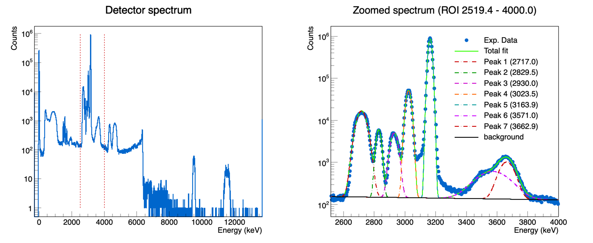

# Detector Spectrum Analysis (ROOT)

ROOT macros for reading, plotting, and fitting a charged-particle detector energy spectrum. The spectrum contains  (overlapping) peaks sitting on a background; the macros fit them with a sum of Gaussians plus a linear or exponential background, and report the position, area, and uncertainty of each peak.

## Author

**Le Tuan Anh**
📧 letuananh.nuclphys@gmail.com
📅 Created September 2026

## Repository contents

```
.
├── AnalyzeDetectorSpectrum.C              # unified macro (recommended) — pick channel or energy axis at run time
├── AnalyzeDetectorSpectrum_Channel.C      # legacy: fit on raw ADC channel axis only
├── AnalyzeDetectorSpectrum_Calibrated.C   # legacy: fit on calibrated energy (keV) axis only
├── Histo_test.txt                        # raw spectrum data (input)
└── README.md
```

`Histo_test.txt` is a plain text file with one integer per line: the number of counts in that ADC channel. There is no header; line 1 = channel 0, line 2 = channel 1, and so on.

> **`AnalyzeDetectorSpectrum.C` is the recommended entry point.** It merges the two legacy macros: the fit axis (raw channel vs. calibrated energy) is now a run-time choice instead of two separate files, so the ROI/peak/background settings only need to be maintained in one place. The two legacy files are kept for reference but are no longer updated.

## Requirements

- [ROOT](https://root.cern) 6.x (standard `TH1F`, `TF1`, `TGraphErrors`, `TFitResult` classes; no external dependencies).

## Usage

ROOT automatically calls the function matching the file name.

```bash
# Fit on the CHANNEL axis (default), full fit + area calculation
root -l AnalyzeDetectorSpectrum.C

# Display only (read + plot the spectrum, skip fitting)
root -l 'AnalyzeDetectorSpectrum.C(true)'
```

Edit `INPUT_FILE` near the top of the macro if your spectrum file has a different name/path.

### Output

- A canvas (`detector_spectrum.png`) with two pads:
  - **Pad 1** – the full spectrum (log Y), with the region of interest (ROI) marked by two dashed vertical lines.
  - **Pad 2** – a zoomed view of the ROI (log Y), showing the data points, the individual fitted peaks, the fitted background, and the total fit curve.
- Fit results printed to the console: background parameters, per-peak `Amp`/`Mean`/`Sigma` with uncertainties and correlations, overall `Chi2/NDF`, and each peak's integrated area with propagated uncertainty (plus a calibrated-energy column when fitting on the channel axis).

### Example output



*Left: full spectrum (log scale) with the ROI marked in red. Right: zoomed ROI showing the data, the 5 individual fitted peaks, the fitted background

## What the macro does

1. **Energy calibration** – fits a linear function `E(keV) = a·channel + b` to several known (channel, energy) calibration points. Always computed, regardless of the chosen fit axis.
2. **Read the spectrum** – loads the input file into a `TH1F`.
3. **Background estimation** (`FitBackgroundSides`) – fits a linear (`pol1`) or exponential (`expo`) background using *only* two user-defined peak-free "side windows", so the peaks cannot bias the background estimate.
4. **Multi-peak fit** (`FitGaussPeaks`) – fits the sum of `N_PEAKS` Gaussians plus the (now-fixed) background in a single combined fit. Each peak's initial amplitude guess is estimated locally (histogram maximum near that peak, minus the background level there) rather than from the global spectrum maximum.
5. **Peak area calculation** (`ComputePeakAreas`) – computes each Gaussian's integrated area analytically (`Area = Amp × Sigma × √(2π) / binWidth`), with the uncertainty propagated from the fit's full covariance matrix (including the Amp–Sigma correlation). The `binWidth` division makes the area invariant to whether the fit axis is channel or keV.

## Choosing the fit axis (`AxisMode`)

All ROI/peak/background settings are entered **once**, in channel units (variable names ending in `_CH`), and are automatically converted when needed:

```cpp
enum class AxisMode { kChannel, kEnergy }; // Only in AnalyzeDetectorSpectrum.C
```

- `AxisMode::kChannel` – the histogram and fit stay in raw ADC channels; `ComputePeakAreas` additionally prints each peak's calibrated energy for reference.
- `AxisMode::kEnergy` (default) – the histogram is built directly with a calibrated keV axis, and `ROI_MIN_CH`/`PEAK_GUESS_CH`/`SIGMA_GUESS_CH`/background windows are converted to keV before fitting (peak positions via the full calibration, widths scaled by the calibration slope only).

## Customizing a fit

```cpp
// for Calibration if needed
calibFunc = new TF1("fEcal0", "[0]*x+[1]", 0, 4096);            // Change number of bins if needed
double E0[4]  = {0, 3157, 5156.59, 5485};       // change known energies (keV) if needed
double ch0[4] = {80.50, 1008, 1592.2, 1691};    // change corresponding channels if needed
// Other:
const char* INPUT_FILE = "Histo_test.txt";                        // Change INPUT spectrum file
const int    N_PEAKS     = 5;                                    // number of peaks in the ROI
const bool   USE_EXP_BKG = false;                             // false = linear bkg, true = exponential
std::vector<double> PEAK_GUESS  = {879, 911, 940, 968, 1009};  // initial peak positions (channel)
std::vector<double> SIGMA_GUESS = {12, 5, 6, 5, 3.5};          // initial peak widths (channel)
const double BKG_LOW_MIN  = 820.0, BKG_LOW_MAX  = 855.0;    // peak-free window below the peaks
const double BKG_HIGH_MIN = 1035.0, BKG_HIGH_MAX = 1060.0;  // peak-free window above the peaks
// only in AnalyzeDetectorSpectrum.C : 
AxisMode fitMode = AxisMode::kEnergy;                             // Change Axis mode 
```

### Fixing individual peak parameters

Any parameter of any peak can be held fixed at a known value instead of being freely fitted, via `FIXED_PARAMS` — always entered in **channel** units regardless of the chosen `AxisMode`; the macro converts each entry automatically (Mean via the full calibration, Sigma by the calibration slope only, Amp unchanged since it's a Y-axis quantity):

```cpp
FIXED_PARAMS = {
    { 3, ParamType::kMean,  940.0 },   // fix peak #3's position
    { 4, ParamType::kSigma, 5.0   },   // fix peak #4's width
};
```

## Notes

- Peak numbering in all output is 1-based (`Peak 1` = the first entry in `PEAK_GUESS`).
- The two legacy single-axis files are not guaranteed to stay in sync with `AnalyzeDetectorSpectrum.C` — prefer the unified macro for any new work.


