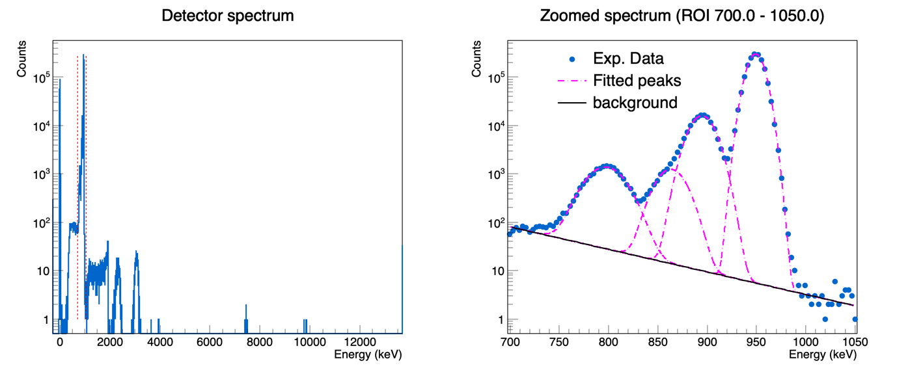

# ROOT-based Detector Spectrum Analysis

ROOT macros for a full analysis pipeline, from a raw charged-particle detector energy spectrum all the way to differential cross sections:

1. **`AnalyzeDetectorSpectrum.C`** – reads, plots, and fits the raw spectrum (sum of Gaussians plus a linear/exponential background), and reports the position, area, and uncertainty of each peak.
2. **`ComputeCrossSectionCM.C`** – takes those peak yields (one value per Lab angle, per incident energy) and converts them into dsigma/dOmega in the CM frame, writing a results table and plotting the excitation function for each angle.

## Author

**Le Tuan Anh**
📧 letuananh.nuclphys@gmail.com
📅 Created September 2026

## Repository contents

```
.
├── AnalyzeDetectorSpectrum.C              # Stage 1 (recommended): spectrum fit — pick channel or energy axis at run time
├── AnalyzeDetectorSpectrum_Channel.C      # legacy: fit on raw ADC channel axis only
├── AnalyzeDetectorSpectrum_Calibrated.C   # legacy: fit on calibrated energy (keV) axis only
├── Histo_test.txt                         # raw spectrum data (input to Stage 1)
├── ComputeCrossSectionCM.C                # Stage 2: converts peak yields into CM cross sections
├── cross_section_input.txt                # sample input for Stage 2 — replace with your own data
└── README.md
```

`Histo_test.txt` is a plain text file with one integer per line: the number of counts in that ADC channel. There is no header; line 1 = channel 0, line 2 = channel 1, and so on.

> **`AnalyzeDetectorSpectrum.C` is the recommended entry point for Stage 1.** It merges the two legacy macros: the fit axis (raw channel vs. calibrated energy) is now a run-time choice instead of two separate files, so the ROI/peak/background settings only need to be maintained in one place. The two legacy files are kept for reference but are no longer updated.

## Requirements

- [ROOT](https://root.cern) 6.x (standard `TH1F`, `TF1`, `TGraphErrors`, `TFitResult` classes; no external dependencies).

---

## Stage 1 — Fitting the detector spectrum (`AnalyzeDetectorSpectrum.C`)

ROOT automatically calls the function matching the file name.

```bash
# Fit on the CHANNEL axis (default), full fit + area calculation
root -l AnalyzeDetectorSpectrum.C

# Display only (read + plot the spectrum, skip fitting)
root -l 'AnalyzeDetectorSpectrum.C(true)'
```

Edit `INPUT_FILE` near the top of the macro if your spectrum file has a different name/path.

### Output

- A canvas (`detector_spectrum.png`) with two pads:
  - **Pad 1** – the full spectrum (log Y), with the region of interest (ROI) marked by two dashed vertical lines.
  - **Pad 2** – a zoomed view of the ROI (log Y), showing the data points, the individual fitted peaks, the fitted background, and the total fit curve.
- Fit results printed to the console: background parameters, per-peak `Amp`/`Mean`/`Sigma` with uncertainties and correlations, overall `Chi2/NDF`, and each peak's integrated area with propagated uncertainty (plus a calibrated-energy column when fitting on the channel axis).

### Example output


*Left: full spectrum (log scale) with the ROI marked in red. Right: zoomed ROI showing the data, the 7 individual fitted peaks, the fitted background.*



*Left: full spectrum (log scale) with the ROI marked in red. Right: zoomed ROI showing the data, the 4 individual fitted peaks, the fitted exponential background.*

### What the macro does

1. **Energy calibration** – fits a linear function `E(keV) = a·channel + b` to several known (channel, energy) calibration points. Always computed, regardless of the chosen fit axis.
2. **Read the spectrum** – loads the input file into a `TH1F`.
3. **Background estimation** (`FitBackgroundSides`) – fits a linear (`pol1`) or exponential (`expo`) background using *only* two user-defined peak-free "side windows", so the peaks cannot bias the background estimate.
4. **Multi-peak fit** (`FitGaussPeaks`) – fits the sum of `N_PEAKS` Gaussians plus the background in a single combined fit.
5. **Peak area calculation** (`ComputePeakAreas`) – computes each Gaussian's integrated area analytically (`Area = Amp × Sigma × √(2π) / binWidth`), with the uncertainty propagated from the fit's full covariance matrix (including the Amp–Sigma correlation). The `binWidth` division makes the area invariant to whether the fit axis is channel or keV.

### Choosing the fit axis (`AxisMode`)

```cpp
enum class AxisMode { kChannel, kEnergy }; // Only in AnalyzeDetectorSpectrum.C
```

- `AxisMode::kChannel` – the histogram and fit stay in raw ADC channels; `ComputePeakAreas` additionally prints each peak's calibrated energy for reference. The initial values of `ROI_MIN_CH`/`PEAK_GUESS_CH`/`SIGMA_GUESS_CH`/background windows are given in ADC channels.
- `AxisMode::kEnergy` (default) – the histogram is built directly with a calibrated keV axis, and `ROI_MIN_CH`/`PEAK_GUESS_CH`/`SIGMA_GUESS_CH`/background windows are given in energy units before fitting.

### Customizing a fit

```cpp
// for Calibration if needed
calibFunc = new TF1("fEcal", "[0]*x+[1]", 0, 4096);            // Change number of bins if needed
double kE[4]  = {0, 3157, 5156.59, 5485};       // change known energies (keV) if needed
double ch[4] = {80.50, 1008, 1592.2, 1691};    // change corresponding channels if needed
// Other:
const char* INPUT_FILE = "Histo_test.txt";                        // Change INPUT spectrum file
const int    N_PEAKS     = 5;                                    // number of peaks in the ROI
const bool   USE_EXP_BKG = false;                             // false = linear bkg, true = exponential
std::vector<double> PEAK_GUESS  = {879, 911, 940, 968, 1009};  // initial peak positions 
std::vector<double> SIGMA_GUESS = {12, 5, 6, 5, 3.5};          // initial peak widths 
const double BKG_LOW_MIN  = 820.0, BKG_LOW_MAX  = 855.0;    // peak-free window below the peaks
const double BKG_HIGH_MIN = 1035.0, BKG_HIGH_MAX = 1060.0;  // peak-free window above the peaks
// only in AnalyzeDetectorSpectrum.C : 
AxisMode fitMode = AxisMode::kEnergy;                             // Change Axis mode 
```

#### Fixing individual peak parameters

Any parameter of any peak can be held fixed at a known value instead of being freely fitted, via `FIXED_PARAMS` — Exg:

```cpp
FIXED_PARAMS = {
    { 3, ParamType::kMean,  940.0 },   // fix peak #3's position
    { 4, ParamType::kSigma, 5.0   },   // fix peak #4's width
};
```

---

## Stage 2 — Computing cross sections (`ComputeCrossSectionCM.C`)

Once Stage 1 has produced a peak `Mean`/`Area`/uncertainty for every angle and every incident energy of interest, those numbers are collected (currently by hand — see note below) into `cross_section_input.txt`, one row per incident energy. `ComputeCrossSectionCM.C` then converts each yield into a Lab and Center-of-Mass differential cross section.

### Data flow between the two stages

```
AnalyzeDetectorSpectrum.C  --(ComputePeakAreas output: Mean, Area, error)-->  cross_section_input.txt  -->  ComputeCrossSectionCM.C
        (Stage 1, per spectrum/detector)                                  (one row per Ep, one Y/dY pair per angle)        (Stage 2)
```

Each `Y<angle>` column is the peak **Area** printed by `ComputePeakAreas` for that angle's detector; each `dY<angle>` is the corresponding propagated area uncertainty. This step is currently manual — there is no script (yet) that automatically appends a Stage-1 result into the Stage-2 input file.

### Input file format (`cross_section_input.txt`)

The file is self-documenting: it starts with a `#`-commented block explaining every column, followed by one header row and then the data rows. Lines starting with `#` are comments and are skipped entirely.

```
# ... (explanatory comment block, see the file itself) ...
Np		RunId	Ep	Nt	Y60	dY60	Y80	dY80	Y100	dY100	Y120	dY120	Y150	dY150
1.95038E+14	13	3.2	1.74822E+18	x	x	399277	x	227866	x	x	x	99688	x
...
```

- `Np` – total number of incident protons; `RunId` – run/point index (not used in the calculation); `Ep` – incident proton energy (MeV); `Nt` – target areal density (nuclei/cm²).
- `Y<angle>` – peak yield (counts) at that Lab angle; `dY<angle>` – its uncertainty, or `"x"` if not available (see fallback rule below).
- Use `"x"` (or `"X"`/`"-"`) for any missing `Y` or `dY` value.

**The Lab angle list is read directly from the `Y<angle>`/`dY<angle>` labels in the header row** — it is not hard-coded in the macro. If you add, remove, or reorder an angle's columns, rename its `Y<angle>`/`dY<angle>` labels to match, and keep every `Y` column immediately followed by its own `dY` column.

### Usage

```bash
root -l ComputeCrossSectionCM.C
```

Edit `INPUT_FILE` near the top of the macro if your input file has a different name/path (update it if you rename `cross_section_input.txt`).

### Output

- `cross_section_cm.txt` – a results table: `Ep`, `Np`, and `CS_CM_<angle>`/`Err_<angle>` for every angle found in the input header.
- `cross_section_cm.png` – the excitation function dsigma/dOmega(CM) vs. `Ep`, one colored curve per angle, log-Y scale.
- Console printout of the angle list detected from the header, and a completion message.

### What the macro does

1. **Read the header** (`ParseHeaderAngles`) – dynamically determines the Lab angle list from the `Y<angle>` column labels.
2. **Read each data row** (`ParseDataLine`) – extracts `Np`, `Ep`, `Nt`, and the `Y`/`dY` token pair for every angle.
3. **Kinematics + cross section** (`ComputeDiffCrossSectionCM`) – converts `theta_Lab` to `theta_CM` via the exact 2-body relation `theta_CM = theta_Lab + asin(gamma·sin(theta_Lab))`, applies the Lab→CM solid-angle Jacobian, corrects for electronics dead time, and computes `dsigma/dOmega` in both frames.
4. **Error handling** – the statistical error uses the peak-fit uncertainty `dY` when available (`(dY/Y)²`); it falls back to plain Poisson statistics (`1/Y`) only when `dY` is `"x"`. A fixed systematic error budget (target thickness + detector efficiency/solid angle + beam charge, added in quadrature) is always included on top.
5. **Plotting** – fills one `TGraphErrors` per angle and draws them together on a single log-Y canvas.

### Customizing for a different reaction/setup

The physics constants for this reaction/setup are set at the top of `ComputeCrossSectionCM()`,
not as file-level globals — edit them there before switching to a different target,
projectile, or detector geometry:

```cpp
const Double_t SOLID_ANGLE_SR = 0.01227;   // W: detector solid angle (sr), same for all detectors
const Double_t DEAD_TIME      = 0.05;      // electronics dead time fraction (e.g. 0.05 = 5%)
// Systematic error budget (added in quadrature with the statistical error):
//   5% target thickness + 5% detector efficiency/solid angle + 2% beam charge
const Double_t SYS_ERR_SQ     = 0.05 * 0.05 + 0.05 * 0.05 + 0.02 * 0.02;

const Double_t M_PROTON = 1.007825;   // amu -- projectile rest mass (change if not a proton beam)
const Double_t M_TARGET = 18.998403;  // amu -- target nucleus rest mass (change per reaction/target)
const Double_t Q_VALUE   = 0.0;        // MeV -- reaction Q-value (0 for elastic scattering only)
```

| Constant | When to change it |
|---|---|
| `SOLID_ANGLE_SR` | Different detector geometry/distance to target, or a setup where detectors don't all share the same solid angle (in that case, this constant would need to become per-angle instead of a single shared value). |
| `DEAD_TIME` | Different DAQ electronics, count rate, or acquisition settings. |
| `SYS_ERR_SQ` | Re-evaluate the 3 systematic error sources (target thickness, detector efficiency/solid angle, beam charge integration) for your own setup — the 5%/5%/2% values here are specific to this experiment, not universal defaults. |
| `M_PROTON` | Change if the projectile is not a proton (e.g. alpha, deuteron). |
| `M_TARGET` | Change to the target nucleus's mass for the reaction being analyzed (e.g. `18.998403` for ¹⁹F, `12.0` for ¹²C). Since `Nt` must already be the areal density of this same specific nucleus (see above), keep `M_TARGET` and `Nt` consistent with each other. |
| `Q_VALUE` | Set to the reaction's Q-value (MeV) if analyzing an inelastic or transfer reaction instead of pure elastic scattering (`Q_VALUE = 0`). |

> One run of the macro still analyzes a single reaction/target/geometry at a time —
> analyzing a different reaction means editing these values and re-running, not
> switching a setting at run time. Since they now live inside the function body rather
> than as file-level globals, `ComputeDiffCrossSectionCM()` picks up whatever values
> are currently set each time the macro is (re)run.

---

## Notes

- Peak numbering in all `AnalyzeDetectorSpectrum.C` output is 1-based (`Peak 1` = the first entry in `PEAK_GUESS`).
- The two legacy single-axis files are not guaranteed to stay in sync with `AnalyzeDetectorSpectrum.C` — prefer the unified macro for any new work.
- Files generated by running the macros (`detector_spectrum.png`, `cross_section_cm.txt`, `cross_section_cm.png`, etc.)
- The Stage 1 → Stage 2 handoff (copying `Mean`/`Area`/error into `cross_section_input.txt`) is manual for now; a future improvement would be to have `AnalyzeDetectorSpectrum.C` append its results directly into that file.

## Citation

If this code is useful for your work, please consider citing or linking back to this repository:

```
Le Tuan Anh, "ROOT-based Detector Spectrum Analysis", https://github.com/AnhLe263/detector-spectrum-fit.git
```
